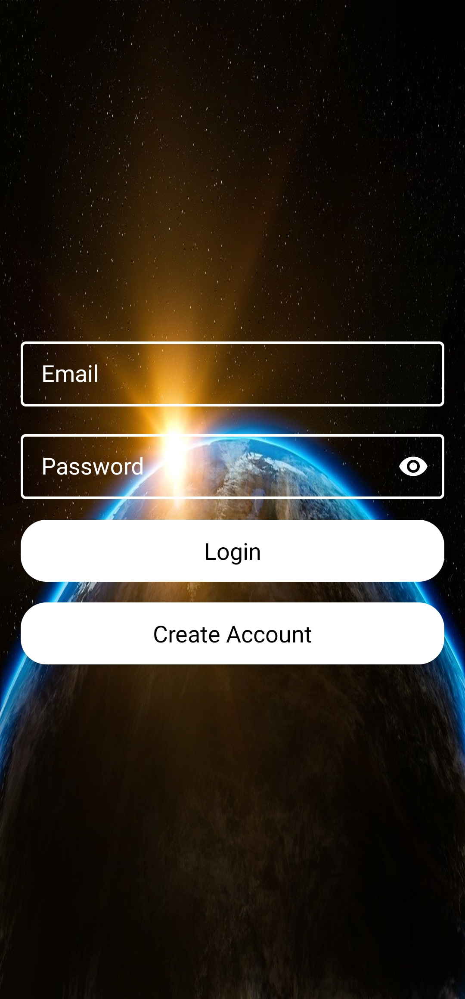

# NASA App

If you are interested in astronomy this app is for you. Application
uses [NASA open api](https://api.nasa.gov/) - APOD (Astronomy Picture of the day) to download daily articles about astronomy. User is able
to save his/her favorites articles locally, to have possibility to read them
even if he/she dosen't have internet at the moment. 

## Demo

###

<h3 align="center">Login | Create Account</h3>

   
  

<h3 align="center">Articles | Saving article | Saved article</h3>

  
   
  

<h3 align="center">Night Mode</h3>

  
   
  

### Features

- MVVM architecture.
- Collapsing Toolbar.
- Local articles DB implemented with Room.
- Articles from NASA api are loaded using Paging.
- Firebase authentication.
- Application supports night theme.

## Used dependencies

- [Kotlin Coroutines](https://developer.android.com/kotlin/coroutines)
- [Kotlin Flow](https://developer.android.com/kotlin/flow)
- [AndroidX](https://developer.android.com/jetpack/androidx)
- [Navigation Component](https://developer.android.com/training/dependency-injection/hilt-android)
- [Hilt](https://developer.android.com/training/dependency-injection/hilt-android)
- [Retrofit](https://square.github.io/retrofit/)
- [Gson](https://github.com/google/gson)
- [Glide](https://github.com/bumptech/glide)
- [Room](https://developer.android.com/jetpack/androidx/releases/room)
- [Firebase](https://firebase.google.com/docs/android/setup)
- [Paging](https://developer.android.com/topic/libraries/architecture/paging)
